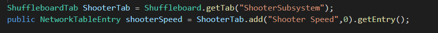

# FRC2022CommandBaseCode
自己编写的使用CommandBase模式控制的5737 FRC2022板版车的程序
# 2023.7.5 周三
今天更新了Shooter里的shuffle功能。

ShuffleboardTab tab = Shuffleboard.getTab("Tab Title");

Shuffleboard.selectTab("Tab Title");

Shuffleboard.getTab("Numbers")
     .add("Pi", 3.14);

class VisionCalculator {
   private ShuffleboardTab tab = Shuffleboard.getTab("Vision");
   private NetworkTableEntry distanceEntry =
       tab.add("Distance to target", 0)
          .getEntry();

   public void calculate() {
     double distance = ...;
     distanceEntry.setDouble(distance);
   }
 }

 class DriveBase extends Subsystem {
   private ShuffleboardTab tab = Shuffleboard.getTab("Drive");
   private NetworkTableEntry maxSpeed =
       tab.add("Max Speed", 1)
          .getEntry();

   private DifferentialDrive robotDrive = ...;

   public void drive(double left, double right) {
     // Retrieve the maximum speed from the dashboard
     double max = maxSpeed.getDouble(1.0);
     robotDrive.tankDrive(left * max, right * max);
   }
}